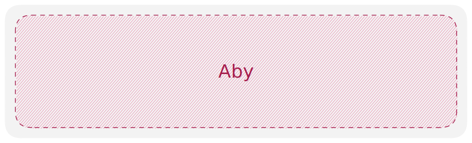

# Aby: Theta's Internal Dev Tool

[](https://github.com/ThetaStudioDev/Aby/actions/workflows/sdk.yml)



## Getting Started

### Installation

For the fastest, most correct installation, please use the `bootstrap.sh` script, which will install dependecies and configure your environment for Aby development.

#### Dependencies

-   Mysys--Download and install from https://www.msys2.org
-   .NET SDK (latest)
-   Rust (nightly)--Use rustup (https://rustup.rs)
-   Deno--`cargo install deno`
-   mdbook--`cargo install mdbook`
-   protobuf--https://github.com/protocolbuffers/protobuf/releases/tag/v26.0
-   Unity 2023.3.20f1+

## Development

TODO: Instructions for running the development environment.

### Debugging

```
.sympath+ "C:\Theta\Aby\runtimes\Unity\Assets\Plugins\JsRuntime"
.reload
kv
```
